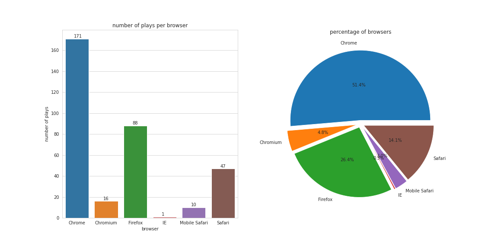

# Data Warehouse

## Contents

1. [Introduction](#1-introduction)
2. [Dataset](#2-dataset)
3. [Repo Structure](3-repo-structure)
4. [Create Tables](#4-create-tables)
5. [Load Data](#5-load-data)
6. [Analyses](#6-analyses)

## 1. Introduction

A music streaming startup, Sparkify, has grown their user base and song database and **want to move their processes and data onto the cloud**. Their data resides in S3, in a directory of JSON logs on user activity on the app, as well as a directory with JSON metadata on the songs in their app.

In this project, I will:
- building an ETL pipeline that extracts their data from S3, stages them in Redshift.
- transforms data into a set of dimensional tables for their analytics team to continue finding insights in what songs their users are listening to.

## 2. Dataset

I'll be working with two datasets that reside in S3:
- Song data: `s3://udacity-dend/song_data`
- Log data: `s3://udacity-dend/log_data`

## 3. Repo Structure

This repo consists of six files and one directories:
1. [dwh.cfg](dwh.cfg) contains information of Redshift database and IAM role.
2. [sql_queries.py](sql_queries.py)  contains all SQL queries to drop, create tables, and transform data from S3 into tables.
3.  [create_table.py](create_tables.py) connects to the database and drops tables (if it exists) before creating it.
4.  [etl.py](etl.py)  load data from S3 to staging tables on Redshift, and load data from staging tables to analytics tables.
5.  [analyses.ipynb](analyses.ipynb)  generates statistics and some analytic graphs on the database.
6.  [images](images)  directory contains all images generated from  `analyses.ipynb`
7.  [README.md](README.md)  (this file) gives a summary of the project and an explanation of designing tables, of transforming data and programming. It also provides analyses on song plays.

## 4. Create Tables

We need two types of tables:
1. staging tables, which are used to load data from JSON files in S3 bucket into database.
2. analytic tables, which are used for analyzing to find the insights into their users' listening.

### 4.1. Staging Tables

#### Staging Songs
Files in song dataset are in JSON format and contain metadata about a song and the artist of that song. An example of what a single song file is in the code below.

```JSON
{
    "num_songs": 1,
    "artist_id": "ARJIE2Y1187B994AB7",
    "artist_latitude": null,
    "artist_longitude": null,
    "artist_location": "",
    "artist_name": "Line Renaud",
    "song_id": "SOUPIRU12A6D4FA1E1",
    "title": "Der Kleine Dompfaff",
    "duration": 152.92036,
    "year": 0
}
```

Therefore, the SQL command below is used to create the staging table `staging_songs`.

```SQL
CREATE TABLE staging_songs(
    artist_id VARCHAR(max),
    artist_latitude FLOAT,
    artist_location VARCHAR(max),
    artist_longitude FLOAT,
    artist_name VARCHAR(max),
    duration FLOAT,
    num_songs INT,
    song_id VARCHAR,
    title VARCHAR(max),
    year INT
)
```
In some cases, fields `artist_id`, `artist_location`, `artist_name`, and `title` have a value that is longer than 256 characters, so these fields are set to type VARCHAR(max).

#### Staging Events

Log files in JSON format generated by [event simulator](https://github.com/Interana/eventsim) based on the songs in the song dataset. An example of what data in a log file is shown in the table below.


Therefore, the SQL command below is used to create the staging table `staging_events`.

```SQL
CREATE TABLE staging_events(
    artist VARCHAR,
    auth VARCHAR,
    first_name VARCHAR,
    gender VARCHAR,
    item_in_section INT,
    last_name VARCHAR,
    length FLOAT,
    level VARCHAR,
    location VARCHAR,
    method VARCHAR,
    page VARCHAR,
    registration FLOAT,
    session_id INT,
    song VARCHAR,
    status INT,
    ts BIGINT,
    user_agent VARCHAR,
    user_id INT
)
```

### 4.2. Analytic Tables

The figure below presents the star schema optimized for queries on song play analysis given by Sparkify team. It includes a fact table `songplays` and four dimension tables `users`,  `songs`, `artists`, `time`.


These SQL commands below are used to create fact and dimension tables.

```SQL
CREATE TABLE songplays(
    songplay_id BIGINT IDENTITY(1, 1) NOT NULL PRIMARY KEY,
    start_time TIMESTAMP NOT NULL,
    user_id INT NOT NULL,
    level VARCHAR NOT NULL,
    song_id VARCHAR NOT NULL,
    artist_id VARCHAR,
    session_id INT,
    location VARCHAR,
    user_agent VARCHAR
)

CREATE TABLE users(
    user_id INT NOT NULL PRIMARY KEY,
    first_name VARCHAR,
    last_name VARCHAR,
    gender VARCHAR,
    level VARCHAR NOT NULL
)

CREATE TABLE songs(
    song_id VARCHAR NOT NULL PRIMARY KEY,
    title VARCHAR(max) NOT NULL,
    artist_id VARCHAR,
    year INT,
    duration FLOAT
)

CREATE TABLE artists(
    artist_id VARCHAR NOT NULL PRIMARY KEY,
    name VARCHAR(max) NOT NULL,
    location VARCHAR(max),
    latitude FLOAT,
    longitude FLOAT
)

CREATE TABLE time(
    start_time TIMESTAMP NOT NULL PRIMARY KEY,
    hour INT,
    day INT,
    week INT,
    month INT,
    year INT,
    weekday INT
)
```

## 5. Load Data

First of all, data is loaded from S3 bucket into staging tables. Then, it will be transformed from staging tables into analytic tables.

### S3 to Staging Tables

```Python
staging_events_copy = ("""
COPY staging_events
FROM {}
CREDENTIALS 'aws_iam_role={}'
FORMAT AS JSON {}
REGION 'us-west-2'
BLANKSASNULL
EMPTYASNULL
""").format(LOG_DATA, ARN, LOG_JSON_PATH)

staging_songs_copy = ("""
COPY staging_songs
FROM {}
CREDENTIALS 'aws_iam_role={}'
FORMAT AS JSON 'auto'
REGION 'us-west-2'
BLANKSASNULL
EMPTYASNULL
""").format(SONG_DATA, ARN)
```

### Staging Tables to Analytic Tables

```SQL
INSERT INTO songplays(start_time, user_id, level, song_id, artist_id,
session_id, location, user_agent)
SELECT
TIMESTAMP 'epoch' + ts::numeric / 1000 * INTERVAL '1 second' AS start_time,
user_id, level, s.song_id, s.artist_id, session_id, location, user_agent
FROM staging_events e
JOIN staging_songs s
ON (s.title = e.song) AND (e.artist = s.artist_name)
WHERE (ts IS NOT NULL) AND (user_id IS NOT NULL)
      AND (level is NOT NULL) AND (song_id IS NOT NULL)

INSERT INTO users
SELECT user_id, first_name, last_name, gender, level
FROM staging_events
WHERE (user_id, ts) IN (
  SELECT user_id, MAX(ts)
  FROM staging_events
  WHERE user_id IS NOT NULL
  GROUP BY user_id) AND (level IS NOT NULL)

INSERT INTO songs
SELECT DISTINCT song_id, title, artist_id, year, duration
FROM staging_songs
WHERE (song_id IS NOT NULL) AND (title IS NOT NULL)

INSERT INTO artists
SELECT DISTINCT artist_id, artist_name, artist_location,
                artist_latitude, artist_longitude
FROM staging_songs
WHERE (artist_id IS NOT NULL) AND (artist_name IS NOT NULL)

INSERT INTO time
SELECT DISTINCT
TIMESTAMP 'epoch' + ts::numeric / 1000 * INTERVAL '1 second' AS start_time,
DATE_PART(h, start_time) as hour,
DATE_PART(d, start_time) as day,
DATE_PART(w, start_time) as week,
DATE_PART(mon, start_time) as month,
DATE_PART(y, start_time) as year,
DATE_PART(weekday, start_time) as weekday
FROM staging_events
WHERE ts IS NOT NULL
```

As user's level can be changed over time, I take only the last information if an user have more than one record in staging tables.

## 6. Analyses

In this section, I do some queries on the database to find insight into Sparkify's users.

### General Statistics

-   Total songplays = 333
-   Total users = 97
-   Total artists = 9553
-   Total songs = 14896

### Which user level is more active on Sparkify app?

```SQL
SELECT level, count(songplay_id)
FROM songplays
GROUP BY level;
```


### What is the ratio of user levels?

```SQL
SELECT level, count(user_id)
FROM users
GROUP BY level;
```


### Which browsers are used to access Sparkify app?

```SQL
SELECT user_agent, count(songplay_id)
FROM songplays
GROUP BY user_agent;
```



### What is the rate of using Sparkify app over weeks?

```SQL
SELECT week, count(songplay_id)
FROM songplays
JOIN time ON songplays.start_time = time.start_time
GROUP BY week
ORDER BY week;
```


### Top users, regions using Sparkify app

```SQL
SELECT user_id, count(songplay_id) AS plays
FROM songplays
GROUP BY user_id
ORDER BY plays DESC
LIMIT 10;

SELECT REVERSE(TRIM(SPLIT_PART(REVERSE(location), ',', 1))) AS region, count(songplay_id) AS plays
FROM songplays
GROUP BY region
ORDER BY plays DESC
LIMIT 10;
```

